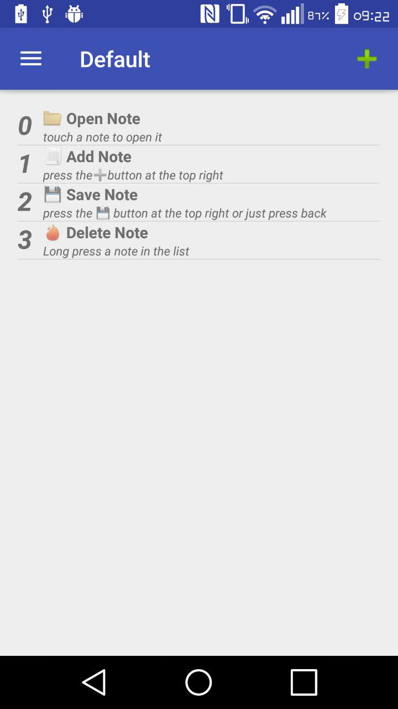
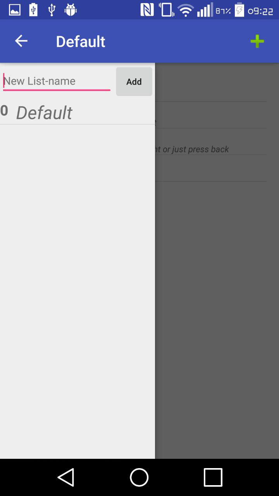
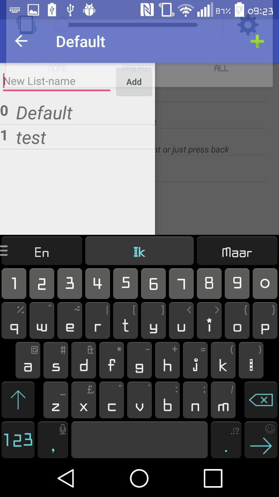
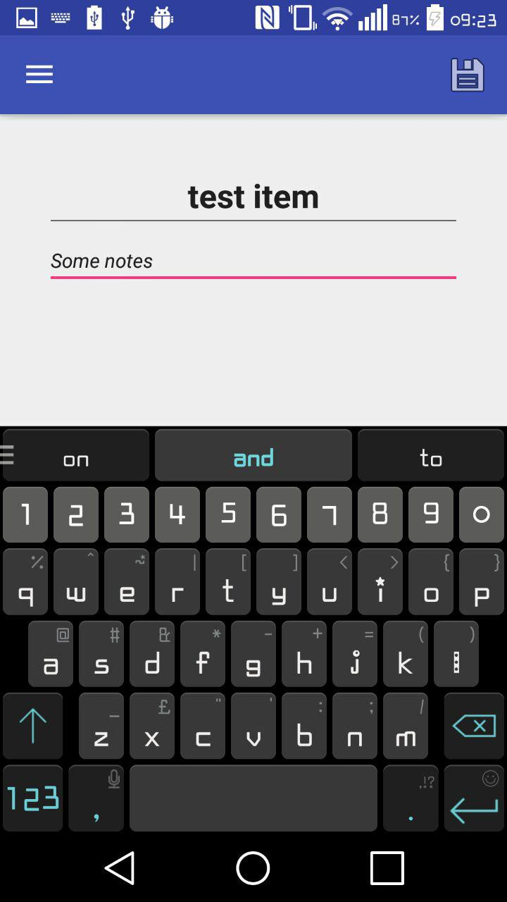

# DasyelWillems-pset5 (ToDo List)
student: Dasyel Willems (10172548)
The fifth problem set app for Native Appstudio.
## Description
This app lets the user create ToDo notes with a title and a description.  
It also has the possibility to manage multiple lists of ToDo notes

## Usage
- See initial notes when the app is started.

## Screenshot

